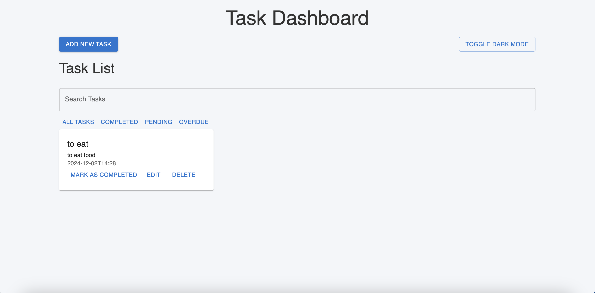
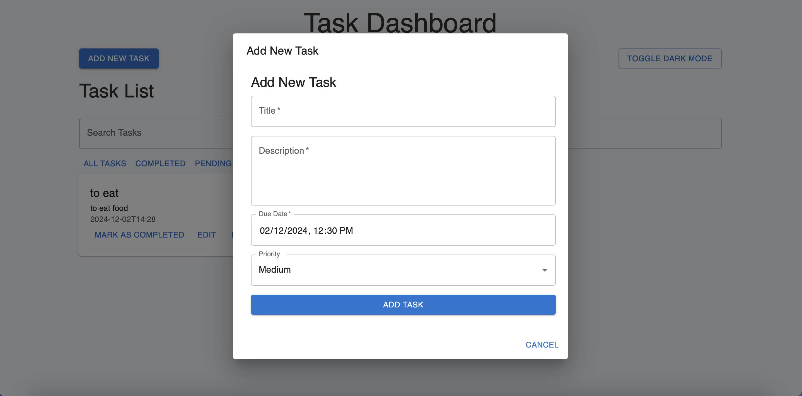
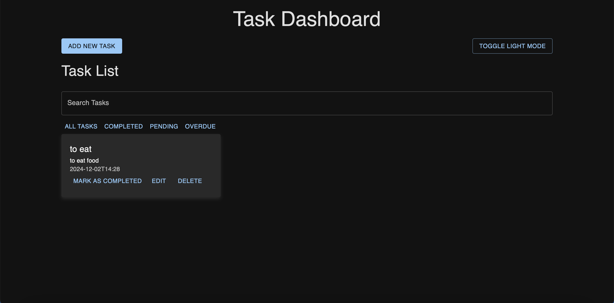

# Task Management App

This is a **Task Management App** built using **React.js** and **Redux** for state management. The application allows users to add, edit, and delete tasks, set reminders for tasks, and manage them through a simple user interface. It supports **dark mode** and is **responsive** for various screen sizes.

---

## Features

- **Add, Edit, Delete Tasks**: Create, update, and remove tasks from the list.
- **Task Reminders**: Set reminders for tasks, and get notifications when the due time is reached.
- **Dark Mode**: Switch between light and dark themes for improved user experience.
- **Responsive Design**: Optimized layout for desktop, tablet, and mobile screens.
- **Material UI**: The app uses Material UI components for a modern look and feel.

---

## Technologies Used

- **Frontend**: React.js, Redux, Material-UI, CSS
- **State Management**: Redux for task management
- **Date & Time**: DateTime picker for setting due dates
- **Notifications**: Browser notifications for task reminders

---

## Installation

### Prerequisites

Make sure you have the following installed on your machine:

- **Node.js**: [Download and install Node.js](https://nodejs.org/en/)
- **npm** (comes with Node.js)

### Steps to Set Up

1. **Clone the repository**:

   ```bash
   git clone https://github.com/yourusername/task-manager-app.git
   cd task-manager-app
   ```

2. **Install dependencies**:

   Run the following command to install all required dependencies:

   ```bash
   npm install
   ```

3. **Start the development server**:

   After the dependencies are installed, start the app:

   ```bash
   npm start
   ```

4. Open the app in your browser at `http://localhost:3000`.

---

## How to Use

1. **Adding a Task**:
   - Click on **"Add New Task"** button.
   - Enter the **Title**, **Description**, and set a **Due Date**.
   - Click **"Add Task"** to save the task.

2. **Editing a Task**:
   - Click on a task from the list.
   - Edit the title, description, and due date, then click **"Save Changes"**.

3. **Deleting a Task**:
   - Click on the **delete icon** on the task card to remove the task.

4. **Reminder Notifications**:
   - Once a task's due date arrives, you will receive a browser notification if it is set.

5. **Dark Mode**:
   - Toggle dark mode by clicking the switch button on the top right corner.

---

## Screenshots

### Home Page



### Add Task Form




### Dark Mode



---

## Contributing

If you would like to contribute to this project, feel free to fork the repository and submit a pull request with your improvements or fixes.

---

## License

This project is open source and available under the [MIT License](LICENSE).

